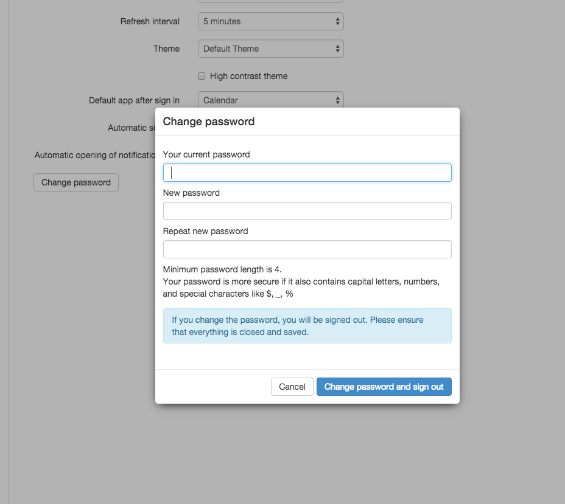

The package `open-xchange-passwordchange-script` allows you to run a command to change a password in an external subsystem like e.g. LDAP. 

# Enable the password change dialog within the App Suite UI

To enable the password change dialog for an App Suite user, simply execute the following command:

```
/opt/open-xchange/sbin/changeuser -c <_context_id_> -u <_user_name_> --access-edit-password on
```

You can also use all other App Suite provisioning interfaces like JAVA RMI or SOAP. Please review the corresponding documentation for each interface for details.

Screenshot of the password change dialog within: App Suite &#8594; Settings &#8594; Basic Settings &#8594; Password



# Configuration Options

As you see in the screenshot, there are different password options like the min. length etc. Those options can be configured within the following properties file. After you have modified this file, you must restart the open-xchange process. 

```
/opt/open-xchange/etc/passwordchange.properties
```

To configure the actual script, which gets executed after the user uses the App Suite password change dialog, you have to edit the following properties file:

```
com.openexchange.passwordchange.script.shellscript=/bin/pwchange.pl
```

**Notes:** If you implement a custom script, you have to implement pre-defined exit codes for your script, which then get translated to user friendly error messages. The list of pre-defined exit codes are documented within the above mentioned properies file.

**Important:** App Suite does not ship with any readymade password change scripts. For examples, please see below. 

**Security:** Since password change scripts processes user supplied input (e.g. the old and new user password) every script is potentially vulnerable against argument injection attacks (see [Argument Injection](https://cwe.mitre.org/data/definitions/88.html)). Therefore, the user passwords needs to be escaped properly. To mitigate the attack vector, it is also possible to prohibit certain characters like spaces in user passwords via configuration:

```
# Optionally configures a pattern to match the entered password against, i.e.
# only passwords matching this pattern will be accepted. Please note that the
# pattern is used to perform a 'positive' test against the entire entered 
# password, and only matching strings are accepted, so use appropriate 
# quantifiers as needed. For example, if the backslash character '\' should 
# not be permitted in passwords, a pattern could look like "[^\\\\]*", or, if 
# only ASCII characters should be allowed, the pattern "[\\x00-\\x7F]*" could
# be used (each without the quotation marks). By default, no pattern is 
# configured, i.e. all character sequences are allowed.
com.openexchange.passwordchange.allowedPattern=
```

## Example Script 1

This example script calls saslpasswd to change the password in the sasldb:

```
#! /usr/bin/perl -w -T
#
# perlsec(1) for security related perl programming
#
use Getopt::Long;
use strict;

my $user;
my $pw;
my $result;
my $cid;
my $oldpassword;
my $userid;

open(LOG, '>>/var/log/pw.log'); 

sub log_error {
       my $errorstring=$_[0];
       print LOG "Error: $errorstring\n";
       die "$errorstring";
}
# secure env
$ENV{'PATH'} = "";
$ENV{'ENV'} = "";

$result = GetOptions ("username=s" => \$user,
                     "cid" => \$cid,
                     "userid" => \$userid,
                     "oldpassword" => \$oldpassword,
                     "newpassword=s" => \$pw);

$user || &log_error("missing parameter username");
print LOG "changing password for user $user\n";
$pw || &log_error("missing parameter newpassword");

my $usersav = $user;

# add a taint check
if ($user =~ /^([-\@\w.]+)$/) {
 $user = $1;                     # $data now untainted
} else {
 &log_error("Bad data in '$user'");
}

die "Can't fork: $!" unless defined(my $pid = open(KID, "|-"));
if ($pid) {           # parent
 print KID $pw;
 close KID;
} else {
 exec '/usr/bin/sudo', '/usr/sbin/saslpasswd2', '-p', "$user"
   or &log_error("can't exec myprog: $!");
}
close(LOG);
```

## Example Script 2

The following script uses ldappasswd to change the password in an LDAP server.

```
#!/bin/bash
ldappasswd -h my_ldap_server -D "uid=$4,ou=people,dc=example,dc=com" -w "$8" \
   -s "${10}" "uid=$4,ou=people,dc=example,dc=com"
```

## Example Script 3

The following script uses open-xchange-passwordchange-script data to change the password within LDAP.

```
#!/usr/bin/perl -w     
# Begin LDAP Stuff
       use Net::LDAP;
       use Net::LDAP::Extension::SetPassword;
my $cid = $ARGV[1];
my $userid = $ARGV[5];
my $oldpw = $ARGV[7];
my $hostname= 'localhost';
my $rootdn= 'cn=Administrator,dc=example,dc=com';
my $userbind= 'ou=People,dc=example,dc=com';
my $adminpasswd='system';
my $name= $ARGV[3];
my $newpasswd= $ARGV[9];
my $ldap = Net::LDAP->new("$hostname")
or die "Host not found: $!";

open(LOG, '>>/var/log/open-xchange/pw.log');  
 
sub log_error {
      my $errorstring=$_[0];
      print LOG "Error: $errorstring\n";
      die "$errorstring";
}
 
$name || &log_error("missing parameter username");
print LOG "changing password for $ARGV[2]: $name with $ARGV[0]: $cid and $ARGV[4]: $userid\n";
$newpasswd || &log_error("missing parameter newpassword");
 
 $ldap->bind( "$rootdn", password => "$adminpasswd" );

my $mesg = $ldap->set_password(
   newpasswd => "$newpasswd",
   user      => "uid=$name,$userbind"
   );
 
  die "error: ", $mesg->code(), ": ", $mesg->error() if ( $mesg->code() );
  close(LOG);
```